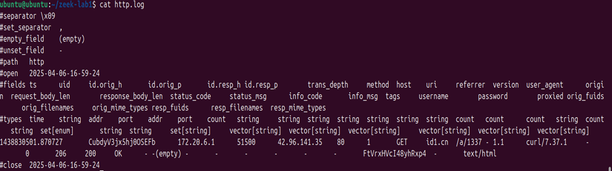
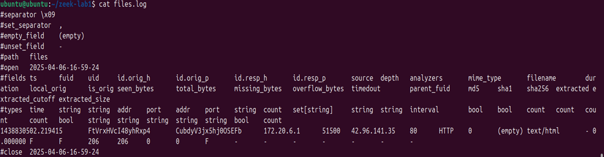
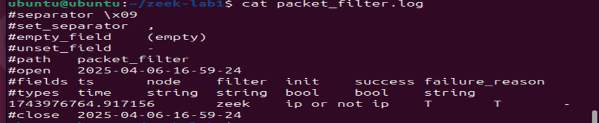
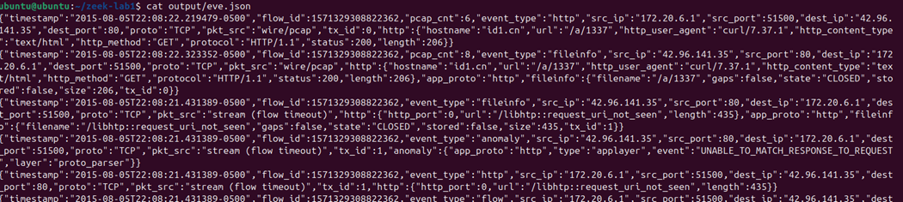
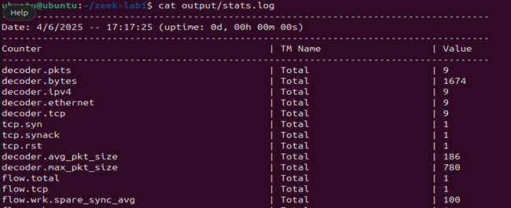
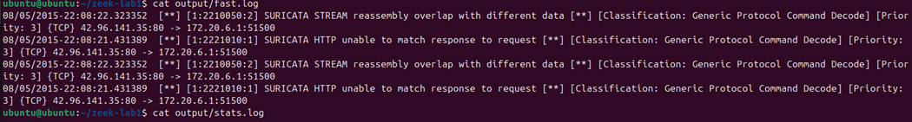

# Security Onion Lab - Network Security Monitoring & Alert Triage

A hands-on network security monitoring lab using Zeek and Suricata to analyze a malicious PCAP dataset, triage IDS alerts, and correlate network events - mirroring core SOC Tier 1 analyst workflows.

---

## Lab Environment

| Component | Details |
|---|---|
| OS | Ubuntu / Kali Linux |
| Dataset | id1.cn-inject.pcap |
| Tools | Zeek, Suricata |
| Output Logs | conn.log, http.log, files.log, packet_filter.log, eve.json, fast.log, stats.log |

---

## Lab Workflow

### 1. Zeek - Deep Packet Inspection & Network Metadata

Zeek performs deep packet inspection and generates structured logs for connections, HTTP traffic, DNS, and file transfers which are useful for both real-time monitoring and historical forensic analysis.

```bash
zeek -r id1.cn-inject.pcap
```

**conn.log** - Detected a TCP connection from `172.20.6.1 → 42.96.141.35` over port 80 with a large byte transfer asymmetry, consistent with potential data exfiltration behavior.



**http.log** - Revealed HTTP URIs, user-agent strings, and referrer headers for further investigation.

**files.log** - Captured file activity including MIME types and sizes, useful for malware triage and forensic analysis.



**packet_filter.log** - Confirmed traffic capture scope and filter parameters applied during analysis.



---

### 2. Suricata - Signature-Based Threat Detection & Alerting

Suricata is an IDS/IPS/NSM engine that detects known threats via signatures and supports deep packet inspection for real-time alerting.

```bash
sudo suricata -r id1.cn-inject.pcap -l output/
```

**eve.json** - Structured alert output including HTTP method, hostname, and payload fingerprint for each detected event.



**stats.log** - Suricata processed 9 packets in 0.15 seconds with no errors, confirming clean tool execution.



**fast.log** - Human-readable alert summary. Suricata triggered **2 alerts** matching known threat signatures in the dataset.



---

## Key Finding

The PCAP dataset contained indicators consistent with a **CN-inject attack pattern** - a technique involving malicious content injection over HTTP. Zeek surfaced the anomalous byte transfer and connection metadata, while Suricata's signature engine fired 2 alerts confirming known threat patterns in the traffic.

---

## Zeek vs Suricata - When to Use Each

| | Zeek | Suricata |
|---|---|---|
| **Strength** | Deep behavioral analysis & metadata | Real-time alerting & signature detection |
| **Output** | Structured logs (conn, http, dns, files) | Alerts (eve.json, fast.log) |
| **Best for** | Forensic investigation, traffic profiling | Threat detection, IDS/IPS operations |
| **Used together** | Full-spectrum NSM coverage | Full-spectrum NSM coverage |

---

## MITRE ATT&CK Mapping

| Technique | ID | Relevance |
|---|---|---|
| Exfiltration Over C2 Channel | T1041 | Asymmetric byte transfer flagged in conn.log |
| Application Layer Protocol: Web Protocols | T1071.001 | HTTP-based traffic analyzed via Zeek and Suricata |
| Network Sniffing | T1040 | PCAP-based traffic capture and analysis |

---

## Skills Demonstrated

`Network Security Monitoring` `PCAP Analysis` `Zeek Log Analysis` `Suricata Alert Triage` `IDS/IPS Operations` `Signature-Based Detection` `Incident Investigation` `MITRE ATT&CK Mapping`

---

## Key Takeaway

Even without the full Security Onion suite, Zeek and Suricata together provide robust network visibility. Zeek excels at building a complete picture of network behavior; Suricata fires on known bad. In a real SOC environment, both feeds are essential for effective triage and investigation.

---

> All analysis was performed in a controlled lab environment using a publicly available PCAP dataset.

**Author:** Durga Sai Sri Ramireddy | MS Cybersecurity, University of Houston  
[](https://linkedin.com/in/durga-ramireddy)
[](https://github.com/DurgaRamireddy)
